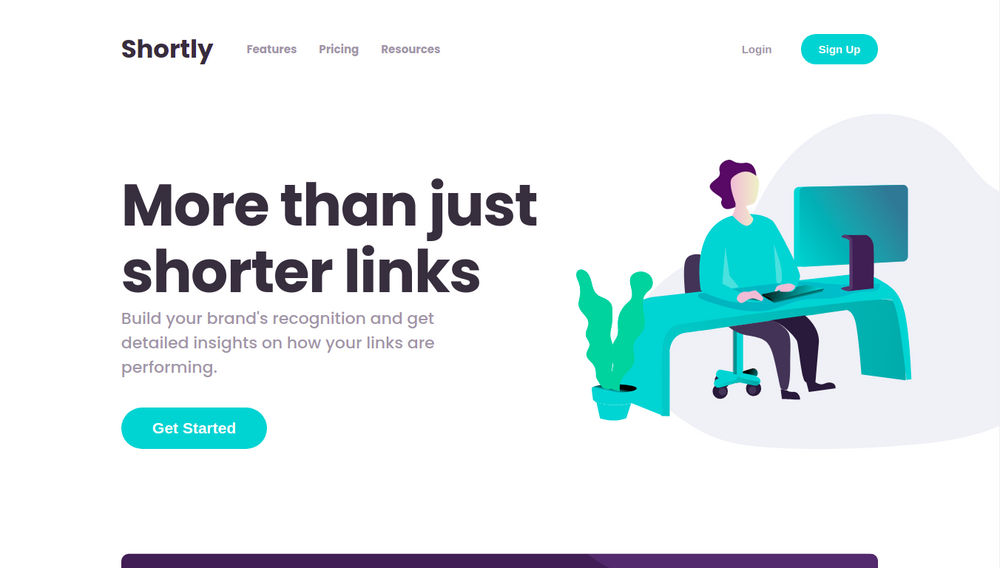

# Frontend Mentor - Shortly URL shortening API Challenge

This is a solution to the [URL shortening API landing page challenge on Frontend Mentor](https://www.frontendmentor.io/challenges/url-shortening-api-landing-page-2ce3ob-G). Frontend Mentor challenges help you improve your coding skills by building realistic projects.

## Table of contents

- [Overview](#overview)
  - [The challenge](#the-challenge)
  - [Screenshot](#screenshot)
  - [Links](#links)
- [My process](#my-process)
  - [Built with](#built-with)
  - [What I learned](#what-i-learned)
  - [Continued development](#continued-development)
  - [Useful resources](#useful-resources)
- [Installation](#installation)
  - [Install dependencies](#install-dependencies)
  - [Configuration](#configuration)
  - [Run the project](#run-the-project)
- [Author](#author)

## Overview

### The challenge

Users should be able to:

- View the optimal layout for the site depending on their device's screen size
- Shorten any valid URL
- See a list of their shortened links, even after refreshing the browser
- Copy the shortened link to their clipboard in a single click
- Receive an error message when the `form` is submitted if:
  - The `input` field is empty

### Screenshot



### Links

- [Solution URL](https://www.frontendmentor.io/solutions/url-shortening-api-landing-page-react-and-typescript-Hg17fAVCI)
- [Live Site](https://shortlyfm.vercel.app)

## My process

### Built with

- ReactJS
- TypeScript
- Bitly

### What I learned

I practiced my layout skills and learned new concepts to use the Bitly api.

### Continued development

Bitly is a very popular and useful tool, which I had never explored until the time I developed this project, so for now I only know the basics of Bitly, I plan to take another look at the documentation to explore more features.

### Useful resources

- [Bitly Developer](https://dev.bitly.com/) - Bitly's documentation explains how to manage your links and implement its API in your projects, from authentication, rate limits, managing analytics, etc.

## Installation

### Install dependencies

```bash
cd url-shortening
yarn
```

### Configuration

Create a `.env.local` file and enter the credentials provided by Bitly.
Use the `.env.local.example` as an example.

### Run the project

```bash
yarn start
```

## Author

- Website - [Luis Manuel](https://www.luismanuelglz.com)
- Frontend Mentor - [@LuisManuelGlz](https://www.frontendmentor.io/profile/LuisManuelGlz)
- Twitter - [@LuisManuelGlz\_](https://twitter.com/LuisManuelGlz_)
